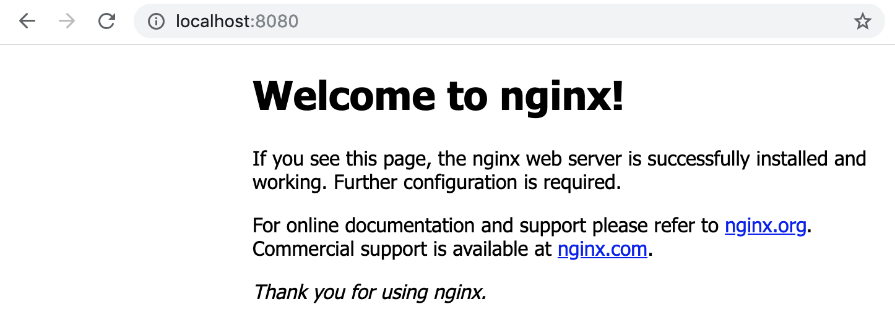
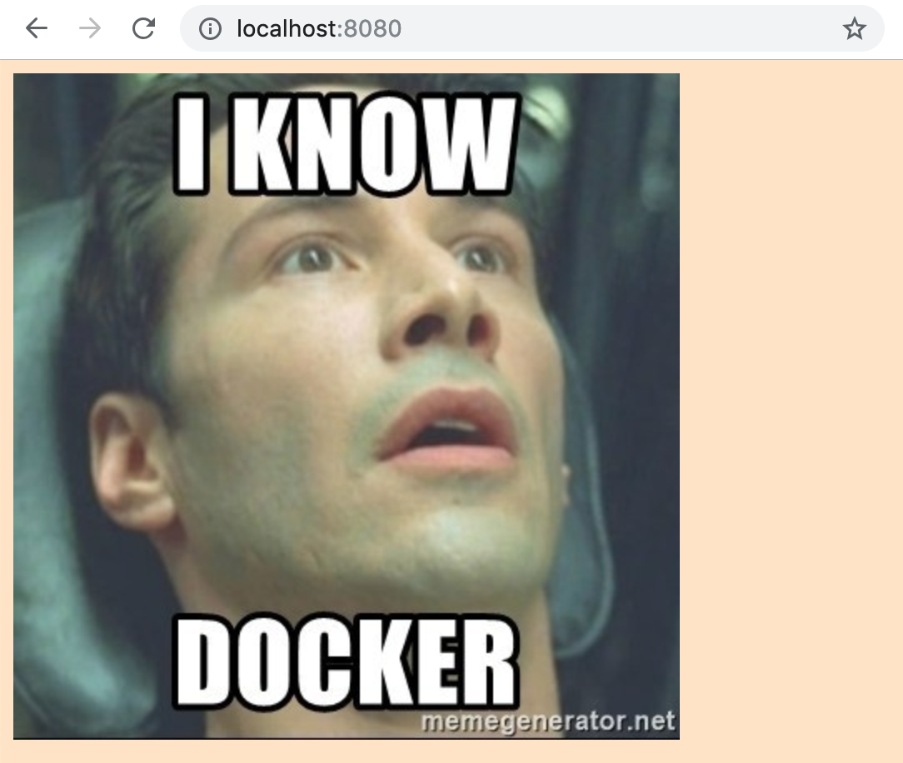

# Lab 01 - Running your first Docker containers

In this first lab we will focus on running containers from already existing
images.  There are a couple of prequisites for this lab:
* you will need to have [Docker Desktop](https://www.docker.com/products/docker-desktop)
installed and running on your laptop
* you will need to have this repository checked out on your laptop

Installing Docker Desktop is a very easy and straight forward process, simply
download the installer from this link and run it (to access the download
you will need a [Docker Hub](https://hub.docker.com/) account, see 
[Lab 00](../lab-00/) for details on how to create a free Docker Hub account):

> https://download.docker.com/mac/stable/Docker.dmg

Once the installation is complete open the terminal on your laptop and run the 
following command:

```
docker info
```

The above command should generate output such as the output below:

```
Containers: 7
 Running: 0
 Paused: 0
 Stopped: 7
Images: 7
Server Version: 18.09.2
Storage Driver: overlay2
 Backing Filesystem: extfs
 Supports d_type: true
 Native Overlay Diff: true
Logging Driver: json-file
Cgroup Driver: cgroupfs
Plugins:
 Volume: local
 Network: bridge host ipvlan macvlan null overlay
 Log: awslogs fluentd gcplogs gelf journald json-file local logentries splunk syslog
Swarm: inactive
Runtimes: runc
Default Runtime: runc
Init Binary: docker-init
containerd version: 9754871865f7fe2f4e74d43e2fc7ccd237edcbce
runc version: 09c8266bf2fcf9519a651b04ae54c967b9ab86ec
init version: fec3683
Security Options:
 seccomp
  Profile: default
Kernel Version: 4.9.125-linuxkit
Operating System: Docker for Mac
OSType: linux
Architecture: x86_64
CPUs: 2
Total Memory: 1.952GiB
Name: linuxkit-025000000001
ID: 5GMH:JGA5:NRE7:453Z:DOBB:KFGU:VV7E:O2EF:57AS:WUWX:5HZK:HMNF
Docker Root Dir: /var/lib/docker
Debug Mode (client): false
Debug Mode (server): true
 File Descriptors: 24
 Goroutines: 51
 System Time: 2019-02-27T10:55:52.3772358Z
 EventsListeners: 2
HTTP Proxy: gateway.docker.internal:3128
HTTPS Proxy: gateway.docker.internal:3129
Registry: https://index.docker.io/v1/
Labels:
Experimental: true
Insecure Registries:
 127.0.0.0/8
Live Restore Enabled: false
Product License: Community Engine
```

## Task 1: Hello world!

To run your very first (one-off) container, simply execute the following command 
in your terminal:

```
docker run gluobe/hello-world
```

When succesful you will be prompted with the following output (read the output
carefully to better understand all the technical things that happened behind the 
scenes in order to produce this output):

```
##############################################################################
###                               Hello world!                             ###
##############################################################################


                                   ##         .
                             ## ## ##        ==
                          ## ## ## ## ##    ===
                      /"""""""""""""""""\___/ ===
                     {                       /  ===-
                      \______ O           __/
                        \    \         __/
                         \____\_______/


##############################################################################

Hello from Docker!
This message shows that your installation appears to be working correctly.

To generate this message, Docker took the following steps:
 1. The Docker client contacted the Docker daemon.
 2. The Docker daemon pulled the "gluobe/hello-world" image from the Docker Hub.
 3. The Docker daemon created a new container from that image which runs the
    executable that produces the output you are currently reading.
 4. The Docker daemon streamed that output to the Docker client, which sent it
    to your terminal.
 5. As soon as the executable finished the container is terminated by the Docker
    daemon.

To try something more ambitious, you can run an Ubuntu container with:
 $ docker run -it ubuntu bash

Share images, automate workflows, and more with a free Docker ID:
 https://hub.docker.com/

For more examples and ideas, visit:
 https://docs.docker.com/get-started/#

##############################################################################
```

## Task 2: running an interactive container

The container above ran a single command and was terminated as soon as that 
command was completed.  Often we want to interact with our container, to do so 
we will need to run an interactive container.

To run an interactive container we need to add some additonal options and 
parameters to the basic `docker run` command that we previously used:
* `-ti` to make the container interactive
* `bash` to  specify the command

Execute the command below to run an interactive Ubuntu container:

```
docker run -ti ubuntu bash
```

After the Ubuntu image has been downloaded you should see that your prompt will 
automatically change.

```
macsteven:~ trescst$ docker run -ti ubuntu bash
root@5b91b65eb29f:/#
```

You are now "inside" the Ubuntu container and can now do pretty much everything
that you would be able to do on a regular Ubuntu system.

```
root@5b91b65eb29f:/# cat /etc/lsb-release
DISTRIB_ID=Ubuntu
DISTRIB_RELEASE=18.04
DISTRIB_CODENAME=bionic
DISTRIB_DESCRIPTION="Ubuntu 18.04.1 LTS"
```

```
root@5b91b65eb29f:/# apt-get update
Get:1 http://archive.ubuntu.com/ubuntu bionic InRelease [242 kB]
Get:2 http://security.ubuntu.com/ubuntu bionic-security InRelease [88.7 kB]
Get:3 http://archive.ubuntu.com/ubuntu bionic-updates InRelease [88.7 kB]
Get:4 http://archive.ubuntu.com/ubuntu bionic-backports InRelease [74.6 kB]
Get:5 http://archive.ubuntu.com/ubuntu bionic/main amd64 Packages [1344 kB]
Get:6 http://archive.ubuntu.com/ubuntu bionic/multiverse amd64 Packages [186 kB]
Get:7 http://archive.ubuntu.com/ubuntu bionic/universe amd64 Packages [11.3 MB]
Get:8 http://security.ubuntu.com/ubuntu bionic-security/main amd64 Packages [344 kB]
Get:9 http://security.ubuntu.com/ubuntu bionic-security/multiverse amd64 Packages [3440 B]
Get:10 http://security.ubuntu.com/ubuntu bionic-security/universe amd64 Packages [156 kB]
Get:11 http://archive.ubuntu.com/ubuntu bionic/restricted amd64 Packages [13.5 kB]
Get:12 http://archive.ubuntu.com/ubuntu bionic-updates/restricted amd64 Packages [10.8 kB]
Get:13 http://archive.ubuntu.com/ubuntu bionic-updates/multiverse amd64 Packages [6963 B]
Get:14 http://archive.ubuntu.com/ubuntu bionic-updates/universe amd64 Packages [941 kB]
Get:15 http://archive.ubuntu.com/ubuntu bionic-updates/main amd64 Packages [685 kB]
Get:16 http://archive.ubuntu.com/ubuntu bionic-backports/universe amd64 Packages [3650 B]
Fetched 15.5 MB in 6s (2421 kB/s)
Reading package lists... Done
```

```
root@5b91b65eb29f:/# apt-cache search elinks
elinks - advanced text-mode WWW browser
elinks-data - advanced text-mode WWW browser - data files
elinks-doc - advanced text-mode WWW browser - documentation
```

To "exit" our interactive Ubuntu container simply execute the `exit` command,
notice how the prompt changes back to your normal prompt. You have exited the 
container and are now back on your default shell of you laptop.

```
root@5b91b65eb29f:/# exit
exit
macsteven:~ trescst$
```

> NOTE: by exiting the interactive container we stop the `bash` command and our
> container is automatically terminated.

When we first started our interactive Ubuntu container it took some time before 
we were inside of our container.  Most of this time was because we had to 
download our Ubuntu image first.  But now that we have already downloaded this 
image (it is in our Docker cache), we can start our container in a matter of 
seconds (often even less than a second).

To see how little time it takes to start a new container, we are running the 
same command as above to start a new interactive Ubuntu container:

```
docker run -ti ubuntu bash
```

Now you can exit the container again by typing `exit`.

## Task 3: running services in containers

Altough it might be useful to run one-off containers and interactive containers, 
in most cases however containers are used to run services (for example a web 
service), to do this we will need to introduce a couple additional parameters:
* `-d` to run the container in detached mode (in the background)
* `--name nginx_container` to specify the name for the container
* `-p 8080:80` to expose port 80 of the container to port 8080 on the host 

The following command will run an nginx container that will be accessible 
through port 8080 of you laptop:
```
docker run -d --name nginx_container -p 8080:80 nginx
```

Once the container has started surf to http://localhost:8080 using a browser on
your laptop, you should be greeted with the following page:


If nginx is working stop and remove the container again using the commands 
below:

```
docker stop nginx_container
docker rm nginx_container
```

## Task 4: working with volumes

Often it is needed that files on your laptop are available inside the
container that you are running (for development purposes or for persistent
state reasons for example).  For this we need to use volumes, and again it is
simply a matter of adding an additional parameter:
* `-v $(pwd):/usr/share/nginx/html` to mount the present working directory 
(generated using the `$(pwd)` command) to the `/usr/share/nginx/html` directory 
inside the container

> NOTE: Docker requires the full path on the laptop, as this usually differs we 
> are  using `$(pwd)` to dynamically determine the full path

On your laptop `cd` into the `lab-01` directory of this repository:

```
cd lab-01
```

Run the command below to mount the directory with the html files from your
laptop into the container:

```
docker run -d -p 8080:80 --name nginx_container_volume -v $(pwd)/html:/usr/share/nginx/html nginx
```

Once the container is running surf to http://localhost:8080, you should see the
following page ("hard" refresh if you do not see the page below):


On your laptop make some changes to the index.html (`html/index.html`), for
example the background color.  Once you made some changes and saved those on
your laptop (hard) refresh the page in your browser to see the changes.

If nginx is working with the volume stop and remove the container again using 
the commands below:

```
docker stop nginx_container_volume
docker rm nginx_container_volume
```

## Task 5: clean up

To clean up run the following command:

```
docker system prune
```